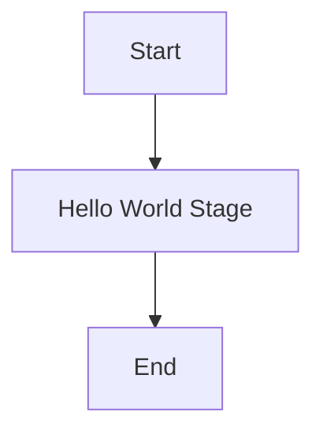

## 目標

本步驟透過實作一個最簡單的 Harness Pipeline（Hello World），讓你能：

- 理解 Harness 專案與 Pipeline 的基本構成
- 確認 Connector 與 Repository 的串接流程
- 驗證 Pipeline 可由 Harness 運行（手動或 CI 觸發）

## 前置需求

- 已有 Harness 帳號或存取權限（UI 或 API/CLI）
- 有一個 Git repository（可為 GitHub/GitLab/Bitbucket）
- 本機有基本工具：`git`、`bash`、`kubectl`（視需求）
- 建議建立一個專案目錄，例如 `harness-sandbox` 來放置 YAML 與範例

## 檔案/目錄建議結構

```
harness-sandbox/
  ├─ pipelines/
  │   └─ hello-world-pipeline.yaml
  └─ README.md
```

## Hello World Pipeline 概念圖



## 範例：最簡單的 Pipeline YAML

下方為一個簡易範例（示意用途，依你使用的 Harness 版本與 schema 可能要做少量調整）：

```yaml
# pipelines/hello-world-pipeline.yaml
pipeline:
  name: Hello World Pipeline
  identifier: hello_world_pipeline
  stages:
    ## 前置需求

    ### 帳號與權限

    - 已有 Harness 帳號或存取權限（UI 或 API/CLI），能在指定 Project 建立 Connector / GitOps 應用
    - 有一個 Git repository（GitHub/GitLab/Bitbucket），且你對該 repo 有 `push` 權限
    - 若要部署到 Kubernetes，需有對目標 cluster 的存取權限（kubeconfig 或相等憑證）

    ### 必要工具（下載與安裝）

    - Git：用於版本控制與 push/pull（檢查：`git --version`）
    - Docker Desktop：提供容器環境；若使用 `kind`，必須安裝並啟動 Docker（檢查：`docker --version` / `docker info`）
    - kubectl：Kubernetes CLI（檢查：`kubectl version --client`）
    - Helm：用於安裝 GitOps Agent 或其他 chart（檢查：`helm version --client`）
    - kind 或 minikube：本地建立測試 k8s cluster（選其一，檢查：`kind --version` 或 `minikube version`）
    - (選用) VS Code：編輯器與整合終端，建議安裝 `GitLens` 與 `YAML` 外掛

    常見安裝方式（Windows 範例）

    ```powershell
            steps:
              - step:
                  type: ShellScript
                  name: Print Hello
                  identifier: print_hello
                  spec:
                    shell: Bash
                    onDelegate: true
                    command: |
                      echo "Hello from Harness!"

```

    ### 前置作業（建議步驟）

    1. 建立專案資料夾並初始化 git（例如 `harness-sandbox`）
    2. 在 GitHub 建立 repo 並將本機 repo push 上去；設定 branch 保護（protected branch）視需要
    3. 在 Harness 中建立 Project 並確認有權限存取（建立 Connector、Agent 等）
    4. 如使用本地測試，啟動 Docker Desktop → 建立 local cluster（`kind create cluster` 或 `minikube start`）
    5. 確認 `kubectl` 可連到 cluster：`kubectl config current-context` 與 `kubectl get nodes`
    6. 建立一個用於 GitOps 的目錄結構（例如 `gitops/overrides` 或 `manifests/dev`）以存放要被監看的檔案
    7. 如果 `override.yaml` 含敏感值，請不要直接 commit 到公開 repo；改用 Kubernetes Secret 或 Harness Secrets 管理

    ### 快速檢查指令

    ```bash

注意：不同 Harness 版本/安裝方式（Cloud vs On-prem）與 Provider 可能會有細節差異，請以你帳號下的 Pipeline Schema 為準。

## 操作步驟（高階）

1. 在本機建立專案資料夾並初始化 git：


    建議建立一個專案目錄，例如 `harness-sandbox` 來放置 YAML 與範例
```bash
mkdir harness-sandbox
cd harness-sandbox
git init
mkdir pipelines
```

2. 把上面的 `hello-world-pipeline.yaml` 儲存到 `pipelines/` 後，提交至你的遠端 repo：

```bash
git add pipelines/hello-world-pipeline.yaml
git commit -m "Add Hello World pipeline"
git remote add origin <your-repo-url>
git push -u origin main
```

3. 在 Harness UI 中建立或設定一個 Project/Connector，連接你的 Git repository（或使用 Harness 的 GitOps 流程）。

4. 從 Harness UI 匯入或建立新 Pipeline，選擇 YAML 檔案路徑 `pipelines/hello-world-pipeline.yaml`，並儲存。

5. 手動執行 Pipeline（Run），觀察執行結果與 `Print Hello` 步驟輸出是否顯示 `Hello from Harness!`。

## 驗證與疑難排解

- 若 Pipeline 無法執行，檢查 Connector（Repository 存取權限）、Delegate 是否已註冊並可存取目標執行環境。
- 若 Shell Script 步驟顯示權限錯誤，確認該步驟是否允許在 Delegate 上執行（`onDelegate: true`）或是否須使用容器執行。
- 查看 Harness 的 Execution Logs（步驟詳細執行紀錄）以取得錯誤與堆疊資訊。

## 建議的延伸練習

- 在 Pipeline 裡新增一個簡單的單元測試步驟（例如執行一個小型測試腳本），使之成為後續 Step2 串接 AI 前的驗收門檻。
- 在本地建立一個簡易 Webhook 或 CI workflow，推送到 `main` 時自動觸發 Harness Pipeline（視你的 Harness 設定與權限）。

## 參考

- Harness 官方文件（以你的帳號與版本為主）
- 本專案後續 Step2 將示範如何把 AI Model（Ollama）串接成 Connector 並在 Pipeline 中使用

## Changelog

| 版本 | 日期 | 撰寫人 | 變更內容 |
| --- | --- | --- | --- |
| 1.0 | 2026-04-20 | Nexvest 團隊 | 初版：建立 Hello World Pipeline 指南 |
