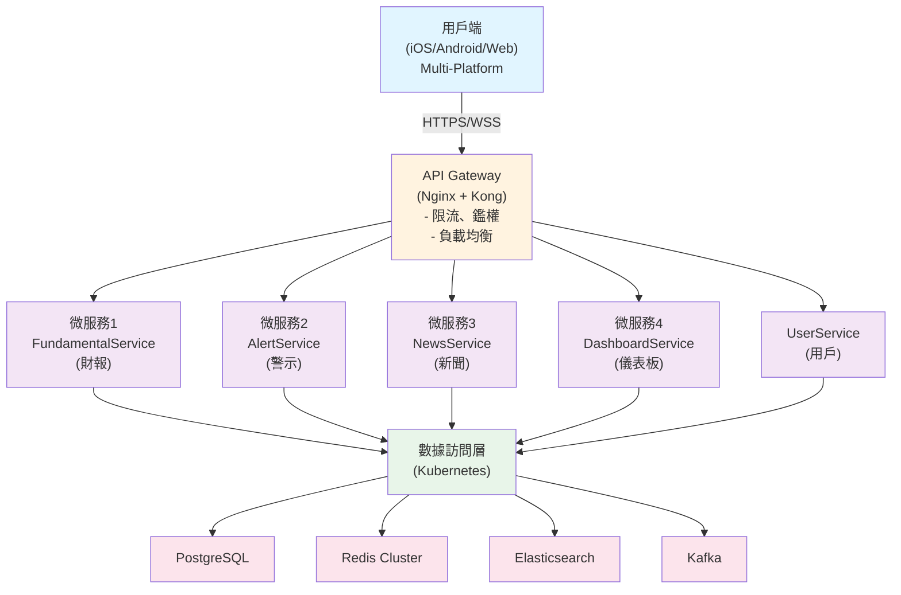

# Phase 1 快速參考指南

**文檔類型**: 系統設計 / 快速參考
**版本**: 1.0
**編制日期**: 2026-04-10
**上次更新**: 2026-04-10
**撰寫人員**: 技術團隊
**審核人員**: 待審核
**適用對象**: 開發團隊 / 架構師 / 項目經理

---

## 文檔概述

**目的**: 為開發團隊提供快速查閱的技術參考與決策彙總

---

## 一頁紙總結

| 維度           | 內容                                               |
| -------------- | -------------------------------------------------- |
| **交付週期**   | 6 週 (Q1-早 Q2)                                    |
| **核心功能數** | 4 個 (財報、警示、新聞、儀表板)                    |
| **目標 DAU**   | 5,000+                                             |
| **目標可用性** | 99.5%                                              |
| **團隊規模**   | 10 人 (後端 3 + 前端 2 + QA 1 + DevOps 1 + 其他 3) |
| **預期花費**   | 366 人·天                                          |

---

## 架構快速參考



---

## 技術棧速查表

### 後端

| 層級         | 技術                 | 用途         |
| ------------ | -------------------- | ------------ |
| **語言**     | TypeScript 4.9+      | 類型安全     |
| **框架**     | Nest.js 9+           | 企業級框架   |
| **ORM**      | TypeORM / Prisma     | 資料庫映射   |
| **資料庫**   | PostgreSQL 14        | 主資料庫     |
| **快取**     | Redis 7 Cluster      | 高效能快取   |
| **搜尋**     | Elasticsearch 8      | 新聞全文搜尋 |
| **訊息佇列** | Kafka 3              | 非同步處理   |
| **容器**     | Docker + K8s         | 部署 & 編排  |
| **監控**     | Prometheus + Grafana | 可觀測性     |
| **日誌**     | ELK Stack            | 日誌聚合     |

### 前端

| 層級        | 技術                | 用途     |
| ----------- | ------------------- | -------- |
| **框架**    | Vue 3               | 核心框架 |
| **建置**    | Vite                | 高速建置 |
| **UI 組件** | Element Plus        | 組件庫   |
| **圖表**    | ECharts 5           | 財務圖表 |
| **狀態**    | Pinia               | 狀態管理 |
| **HTTP**    | Axios               | 網路請求 |
| **行動端**  | React Native (未來) | 跨平台   |
| **測試**    | Vitest + Cypress    | 測試框架 |

### DevOps

| 工具           | 用途       |
| -------------- | ---------- |
| Docker         | 容器化     |
| Kubernetes     | 容器編排   |
| GitHub Actions | CI/CD      |
| Prometheus     | 指標收集   |
| Grafana        | 監控可視化 |
| ELK Stack      | 日誌系統   |

---

## 關鍵 API 端點速查

### 財報相關

```plaintext
GET    /v1/fundamentals/{symbol}
GET    /v1/fundamentals/{symbol}/history
GET    /v1/fundamentals/{symbol}/compare
```

### 警示相關

```plaintext
POST   /v1/alerts
GET    /v1/alerts
PUT    /v1/alerts/{id}
DELETE /v1/alerts/{id}
GET    /v1/alerts/templates
GET    /v1/alerts/:id/triggers
```

### 新聞相關

```plaintext
GET    /v1/news/feed
GET    /v1/news/:id
POST   /v1/news/:id/read
GET    /v1/news/sources
POST   /v1/news/sources/:id/block
GET    /v1/news/search
```

### 儀表板相關

```plaintext
GET    /v1/dashboards
POST   /v1/dashboards
PUT    /v1/dashboards/:id
DELETE /v1/dashboards/:id
POST   /v1/dashboards/:id/clone
GET    /v1/dashboards/templates
```

### 認證相關

```plaintext
POST   /v1/auth/register
POST   /v1/auth/login
POST   /v1/auth/refresh
POST   /v1/auth/logout
GET    /v1/auth/profile
```

---

## 資料庫快速參考

### 核心表 (簡化版)

```sql
-- 使用者表
users (id, phone, email, password_hash, real_name, created_at)

-- 自選股票
watchlists (id, user_id, symbol, remark, created_at)

-- 財務指標
financial_metrics (id, symbol, report_date, roe, fcf, debt_ratio, ...)

-- 健康度評分 (快取)
fundamental_scores (id, symbol, score_date, health_score, level, ...)

-- 警示規則
alerts (id, user_id, symbol, conditions JSONB, status, created_at)

-- 警示觸發記錄
alert_triggers (id, alert_id, user_id, trigger_data JSONB, created_at)

-- 新聞
news (id, title, content, source_id, symbol, sentiment, published_at)

-- 儀表板
dashboards (id, user_id, config JSONB, is_default, created_at)
```

### 關鍵索引

```sql
-- 快速查詢
idx_watchlist: (user_id, symbol)
idx_alert: (user_id, status)
idx_news: (symbol, published_at DESC)
idx_dashboard: (user_id, is_default)
```

### Redis 快取鍵策略

```plaintext
quote:{symbol}                    // 實時行情 (30s TTL)
fundamental:{symbol}:{date}      // 財報指標 (24h TTL)
health_score:{symbol}:{date}     // 評分快取 (12h TTL)
portfolio:{user_id}              // 使用者持股 (5m TTL)
alerts:{user_id}                 // 警示列表 (無 TTL，主動失效)
user_prefs:{user_id}             // 使用者偏好 (15m TTL)
```

---

## 關鍵文件位置

### 後端程式碼結構

```plaintext
src/
├── modules/
│   ├── fundamental/
│   │   ├── fundamental.service.ts    ← 核心業務邏輯
│   │   ├── fundamental.controller.ts  ← API 端點
│   │   └── entities/                  ← 資料模型
│   ├── alert/
│   │   ├── alert.service.ts          ← 警示引擎
│   │   ├── alert-engine.ts           ← 規則評估
│   │   └── ...
│   ├── news/
│   │   ├── news.service.ts
│   │   ├── scraper.ts               ← 爬蟲邏輯
│   │   └── ...
│   ├── dashboard/
│   │   └── ...
│   ├── auth/
│   │   ├── auth.service.ts
│   │   ├── jwt.strategy.ts
│   │   └── ...
│   ├── user/
│   │   └── ...
│   └── common/
│       ├── decorators/
│       ├── filters/
│       ├── interceptors/
│       └── guards/
├── config/
│   ├── database.config.ts
│   ├── redis.config.ts
│   └── cache.config.ts
└── main.ts
```

### 前端程式碼結構

```plaintext
src/
├── components/
│   ├── fundamental/              ← 財報組件
│   │   ├── FundamentalCard.vue
│   │   ├── HealthScoreMeter.vue
│   │   └── TrendChart.vue
│   ├── alert/                    ← 警示組件
│   │   ├── AlertForm.vue
│   │   ├── RuleEditor.vue
│   │   └── ...
│   ├── news/                     ← 新聞組件
│   │   ├── NewsFeed.vue
│   │   ├── NewsCard.vue
│   │   └── ...
│   ├── dashboard/                ← 儀表板組件
│   │   ├── DashboardGrid.vue
│   │   ├── Widget.vue
│   │   └── ...
│   └── common/                   ← 通用組件
│       ├── Header.vue
│       ├── Sidebar.vue
│       └── ...
├── services/                     ← API 呼叫
│   ├── api.ts                    ← HTTP 用戶端配置
│   ├── fundamentalService.ts
│   ├── alertService.ts
│   ├── newsService.ts
│   └── ...
├── stores/                       ← Pinia 狀態管理
│   ├── user.ts
│   ├── portfolio.ts
│   ├── alerts.ts
│   └── ...
├── views/                        ← 頁面
│   ├── Home.vue
│   ├── Stock.vue
│   ├── Dashboard.vue
│   ├── News.vue
│   └── ...
└── router/
    └── index.ts
```

---

## 效能指標目標

### API 回應時間

| API 端點 | P50   | P95   | P99  |
| -------- | ----- | ----- | ---- |
| 財報查詢 | 300ms | 800ms | 1.5s |
| 警示查詢 | 200ms | 600ms | 1s   |
| 新聞流   | 400ms | 1s    | 2s   |
| 儀表板   | 500ms | 1.5s  | 2.5s |

### 視覺效能

| 指標                           | 目標      |
| ------------------------------ | --------- |
| First Contentful Paint (FCP)   | < 1.5s    |
| Largest Contentful Paint (LCP) | < 2.5s    |
| First Input Delay (FID)        | < 100ms   |
| Cumulative Layout Shift (CLS)  | < 0.1     |
| 首屏加載                       | < 2s (3G) |

### 系統可用性

| 指標                | 目標    |
| ------------------- | ------- |
| 服務可用性 (Uptime) | 99.5%   |
| P99 延遲            | < 2s    |
| 錯誤率              | < 1%    |
| 資料準確度          | > 99.5% |

---

## 環境變數 (範例)

```bash
# .env.local
NODE_ENV=development
PORT=3000

# Database
DB_HOST=localhost
DB_PORT=5432
DB_NAME=nexvest
DB_USER=postgres
DB_PASSWORD=xxxxx

# Redis
REDIS_HOST=localhost
REDIS_PORT=6379
REDIS_PASSWORD=

# JWT
JWT_SECRET=your_secret_key_here
JWT_EXPIRES_IN=900  # 15 minutes
REFRESH_TOKEN_EXPIRES_IN=604800  # 7 days

# LLM API (可選)
OPENAI_API_KEY=sk-xxxxx
OPENAI_MODEL=gpt-3.5-turbo

# 第三方服務
NEWS_API_KEY=xxxxx
MARKET_DATA_API_KEY=xxxxx

# 推送服務
APNS_CERT_PATH=/path/to/apple.p8
FCM_KEY_PATH=/path/to/google.json
```

---

## 本地開發啟動指南

### 快速啟動 (Docker Compose)

```bash
# 1. 複製項目
git clone https://github.com/nexvest/nexvest.git
cd nexvest

# 2. 啟動依賴服務 (PostgreSQL, Redis, ES, etc.)
docker-compose up -d

# 3. 後端服務啟動
cd backend
npm install
npm run migration  # 資料庫初始化
npm run seed       # 種子資料
npm run dev        # 開發伺服器

# 4. 前端服務啟動 (新終端)
cd frontend
npm install
npm run dev

# 5. 訪問應用
http://localhost:5173 (前端)
http://localhost:3000 (API)
http://localhost:5601 (Kibana 日誌)
http://localhost:3100 (Grafana 監控)
```

### 後端開發常用命令

```bash
npm run dev              # 啟動開發伺服器 (hot reload)
npm run build           # 編譯生產程式碼
npm run start           # 生產啟動
npm test                # 執行單元測試
npm run test:cov        # 測試覆蓋率報告
npm run lint            # 程式碼檢查
npm run format          # 程式碼格式化
npm run migration       # 資料庫遷移
npm run seed            # 匯入種子資料
npm run docker:build    # 建置 Docker 映像
```

### 前端開發常用命令

```bash
npm run dev              # 啟動開發伺服器
npm run build           # 建置生產版本
npm run preview         # 預覽生產建置
npm test                # 單元測試
npm run test:ui         # 測試 UI 模式
npm run e2e             # E2E 測試
npm run lint            # ESLint 檢查
npm run format          # Prettier 格式化
```

---

## 程式碼審查檢查清單

### 後端 PR 檢查

- [ ] 程式碼符合 TypeScript strict 模式
- [ ] 至少 80% 單元測試覆蓋率
- [ ] 沒有 console.log (使用 logger)
- [ ] 錯誤處理完善 (try-catch / throw)
- [ ] 沒有硬編碼 (使用環境變數/配置)
- [ ] API 端點有權限驗證
- [ ] 資料庫查詢已最佳化 (有索引)
- [ ] 程式碼註解清晰 (複雜邏輯)
- [ ] Swagger 文檔已更新
- [ ] 沒有生產密鑰資訊

### 前端 PR 檢查

- [ ] 程式碼符合 ESLint 規則
- [ ] 至少 70% 單元測試覆蓋率
- [ ] 元件已使用 TypeScript
- [ ] 沒有 console.log (生產環境)
- [ ] 圖片已最佳化 (壓縮, 格式檢查)
- [ ] 功能測試通過 (Cypress)
- [ ] 回應式設計驗證 (Mobile/Tablet/Desktop)
- [ ] 深色模式測試通過
- [ ] 建置大小檢查 (< 500KB gzip)
- [ ] 無瀏覽器控制台錯誤

---

## 故障排查速查表

### 常見問題

#### 問題: API 回應 500

```bash
# 1. 檢查後端日誌
docker logs nexvest-api

# 2. 檢查資料庫連線
psql -h localhost -U postgres -d nexvest -c "SELECT 1"

# 3. 重啟服務
docker-compose restart api
```

**問題: Redis 無法連線**

```bash
# 檢查 Redis 狀態
docker logs nexvest-redis

# 測試連線
redis-cli -h localhost ping  # 應返回 PONG

# 清空快取
redis-cli FLUSHALL
```

**問題: 前端頁面空白**

```bash
# 1. 檢查瀏覽器控制台是否有錯誤
# 2. 檢查 API 是否正常
curl http://localhost:3000/health

# 3. 清除瀏覽器快取
# 4. 檢查網路請求 (Network 標籤)
```

**問題: 測試失敗**

```bash
# 後端測試
npm test -- --verbose

# 前端測試
npm run test:ui

# E2E 測試
npm run e2e -- --headed  # 顯示瀏覽器視窗
```

---

## 重要聯繫方式

| 角色               | 責任            | 聯繫           |
| ------------------ | --------------- | -------------- |
| **後端負責人**     | 財報模組 & 架構 | @backend_lead  |
| **警示系統負責人** | 警示引擎 & API  | @alert_lead    |
| **前端負責人**     | PC 端 UI & 效能 | @frontend_lead |
| **DevOps**         | 基礎設施 & 部署 | @devops        |
| **項目經理**       | 進度 & 溝通     | @pm            |

---

## 緊急聯繫

**系統故障 (生產)**: Slack #incident-response
**關鍵問題討論**: 每日 9:30 站會
**部署窗口**: 周二/周四 14:00-16:00 UTC

---

## 📝 Changelog (變更紀錄)

### 版本歷史

| 版本 | 日期       | 撰寫人   | 審核人 | 變更內容 |
| ---- | ---------- | -------- | ------ | -------- |
| 1.0  | 2026-04-10 | 技術團隊 | 待審核 | 初始版本 |

### 詳細變更記錄

#### v1.0 (2026-04-10)

**撰寫人**: 技術團隊 | **審核人**: 待審核

**內容**:

- 新增文檔頭部 (Front Matter) 規範資訊
- 轉換簡體中文至繁體中文
- 將架構圖從 ASCII 轉換為 Mermaid 格式
- 優化所有程式碼塊的語言標記
- 新增繁體技術術語一致性檢查
- 新增完整的 Changelog 部分

### 下次更新預計

- 開發中期檢查 (2026-04-24)
- 計劃新增: 性能測試結果、最佳實踐指南、常見問題擴展
