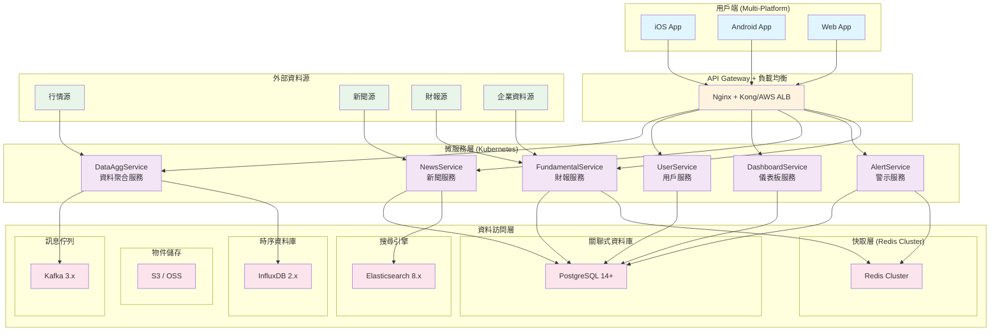
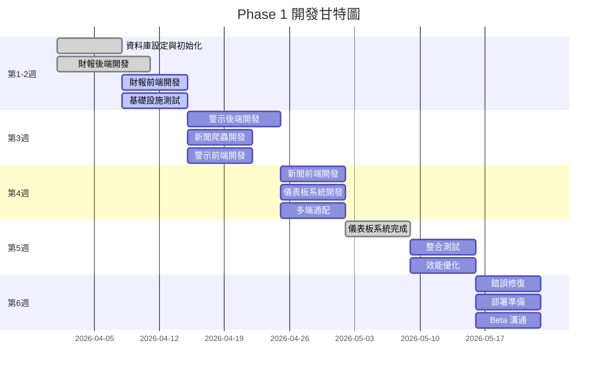

# Nexvest Phase 1 系統設計文檔

**文檔類型**: 系統設計
**版本**: 1.0
**編制日期**: 2026-04-10
**上次更新**: 2026-04-10
**撰寫人員**: 技術團隊
**審核人員**: 待審核
**適用對象**: 架構師 / 開發團隊 / 項目經理

---

## 文檔概述

**目的**: 定義 Nexvest Phase 1 的系統架構、技術選型與實現方案，為 MVP 版本提供完整設計指導。

---

## 目錄

1. [Phase 1 概述](#phase-1-概述)
2. [需求分析](#需求分析)
3. [總體架構設計](#總體架構設計)
4. [技術棧選型](#技術棧選型)
5. [詳細功能設計](#詳細功能設計)
6. [數據庫設計](#數據庫設計)
7. [API 設計](#api-設計)
8. [前端架構](#前端架構)
9. [任務拆分與進度規劃](#任務拆分與進度規劃)

---

## Phase 1 概述

### 目標定位

將 Nexvest 從概念驗證升級為 **MVP (最小可行產品)**，在 6 週內推出四大核心功能，覆蓋 90% 的目標用戶。

### 四大核心功能

| 功能             | 代號 | 優先級 | 覆蓋率 | 開發週期 |
| ---------------- | ---- | ------ | ------ | -------- |
| 視覺化財報健檢   | P1-1 | 最高   | 100%   | 2w       |
| 進階策略警示系統 | P1-2 | 最高   | 60%    | 2w       |
| 抗噪新聞資訊流   | P1-3 | 最高   | 100%   | 1.5w     |
| 自定義儀表板     | P1-4 | 高     | 100%   | 1w       |

### 成功指標

- **DAU**: 5,000+ (日活躍用戶)
- **頁面加載時間**: < 2s (P95)
- **服務可用性**: 99.5%
- **警示推送延遲**: < 1 分钟
- **用户满意度**: > 4.0/5.0

---

## 需求分析

### 功能需求

#### P1-1: 视觉化财报健检系统

**用户痛点**: 投资人难以快速判断公司财务体质变化

**功能目标**: 一秒看出公司各项关键指标的健康度

**核心指标** (5 点制电灯号)：

```plaintext
健康度评分模型：
├─ 盈利能力 (20%)
│  ├─ ROE
│  ├─ 毛利率
│  └─ 净利率
├─ 现金流 (20%)
│  ├─ 自由现金流
│  └─ 营运现金流
├─ 财务稳定 (20%)
│  ├─ 负债比
│  ├─ 流动比率
│  └─ 利息覆盖率
├─ 成长性 (20%)
│  ├─ EPS YoY
│  └─ 营收 YoY
└─ 股东回报 (20%)
   ├─ 股息率
   └─ 股票回购比
```

**主要特性**:

- 5 年 / 10 年历史趋势对比
- 电灯号标示 (红/黄/绿)
- 同业对标对比
- 关键指标预警

**关键场景**:

- 盘中快速查看一只股票的财务状况
- 对比同业了解相对位置
- 识别财务恶化的公司

---

#### P1-2: 进阶策略警示系统

**用户痛点**: 需要实时监控多个自选股的变动，设置多维度警示规则

**功能目标**: 支持自定义警示规则，推送延遲 < 30 秒

**警示类型**:

| 类型         | 触发条件                     | 数据源   | 推送优先级 |
| ------------ | ---------------------------- | -------- | ---------- |
| 价格警示     | 跌破/超过价格阈值            | 实时行情 | 高         |
| 技术面警示   | 黄金交叉、死亡交叉、突破均线 | 技术指标 | 高         |
| 成交量警示   | 异常放大 (> 平均 2 倍)       | 成交数据 | 中         |
| 均线警示     | 跌破关键均线 (20/50/200)     | 技术指标 | 中         |
| 基本面警示   | 财报发布、ROE 异常           | 企业公告 | 高         |
| 市场情绪警示 | VIX > 阈值、机构异常         | 市场数据 | 中         |

**主要特性**:

- 手动设置与预设模板并存
- AND/OR 逻辑组合
- 推送渠道 (应用内 + 移动推送)
- 警示历史记录查询

**关键场景**:

- 设置价格预警，触发后立即通知
- 组合多个技术面条件
- 追踪法人动向

---

#### P1-3: 抗噪新闻资讯流

**用户痛点**: 新闻杂乱，难以找到有价值的信息

**功能目标**: 过滤低质新闻，提供高质量资讯流，聚焦个人关注的股票与产业

**新闻源分级**:

| 级别 | 来源示例                     | 权重 | 是否自动展示 |
| ---- | ---------------------------- | ---- | ------------ |
| 一级 | 官方公告、SEC 申报、财报     | 100% | 是           |
| 二级 | 彭博社、路透社、英国金融时报 | 80%  | 是           |
| 三级 | 主流商业媒体                 | 60%  | 可选         |
| 过滤 | 农场标题、特定黑名单媒体     | 0%   | 否           |

**主要特性**:

- 多源新闻聚合 (彭博、路透、官方公告、雪球等)
- AI 关键字提取与摘要 (初版: 标题 + 3 行摘要)
- 情绪标签 (正面/中性/负面)
- 用户自定义黑名单 (关键字、媒体)
- 按重要性与相关性排序

**关键场景**:

- 快速浏览关注股票的相关新闻
- 排除垃圾信息
- 掌握产业动向

---

#### P1-4: 自定义仪表板系统

**用户痛点**: 默认布局不符合不同用户的使用场景

**功能目标**: Widget 式模块化设计，支持拖放编辑

**预设 Widget 集**:

- 持股绩效卡片
- 大盘指数快视
- 自选股票清单
- 警示摘要
- 财报日程
- 热门新闻区
- 财报健检卡片

**主要特性**:

- 拖放编辑
- 多视图保存 ("盘中快查" vs "深度研究")
- 预设模板库
- 响应式设计

**关键场景**:

- 盘中快速查阅关键信息
- 创建个人化首页
- 保存多套不同配置

---

### 非功能需求

| 维度         | 目标                      | 实现方案                   |
| ------------ | ------------------------- | -------------------------- |
| **性能**     | 页面加载 < 2s, 警示 < 30s | CDN + 缓存 + 异步队列      |
| **安全**     | TLS 1.3 + AES-256 + MFA   | 端到端加密                 |
| **可用性**   | 99.5% uptime              | 主从复制 + 自动转移        |
| **扩展性**   | 10 万 CCU                 | 微服务 + 水平扩展          |
| **可观测性** | 完整日志 + 监控告警       | Prometheus + Grafana + ELK |

---

## 总体架构设计

### 系统架构图



```plaintext
    ├──────────────────────────────────────────────────────────┤
    │  行情源 → 新闻源 → 财报源 → 企业数据源                     │
    └──────────────────────────────────────────────────────────┘
```

### 数据流向

```mermaid
flowchart TD
    subgraph "行情資料流"
        DS1[行情源] --> Adapter[WebSocket Adapter]
        Adapter --> Cache[Redis Cache]
        Cache --> Engine[Alert Engine]
        Engine --> Rules[警示規則匹配]
        Rules --> Queue[推送佇列]
        Queue --> Push[推送服務]
        Push --> User[用戶]
    end

    subgraph "財報資料流"
        DS2[財報源] --> Crawler[資料爬取服務]
        Crawler --> Calc[指標計算]
        Calc --> PG[(PostgreSQL)]
        PG --> API[API Gateway]
        API --> FE[前端展示]
    end

    subgraph "新聞資料流"
        DS3[新聞源] --> Crawler2[爬蟲服務]
        Crawler2 --> NLP[NLP 處理]
        NLP --> ES[(Elasticsearch)]
        ES --> Rec[推薦演算法]
        Rec --> Feed[用戶個人化流]
    end

    subgraph "用戶操作流"
        Client[用戶端] --> API2[API Gateway]
        API2 --> Auth[認證 & 授權]
        Auth --> Biz[業務服務]
        Biz --> DAL[資料層]
        DAL --> Resp[回應]
    end

    style DS1 fill:#e8f5e9
    style DS2 fill:#e8f5e9
    style DS3 fill:#e8f5e9
    style User fill:#e1f5ff
    style FE fill:#e1f5ff
    style Feed fill:#e1f5ff
    style Resp fill:#e1f5ff
````

---

## 技术栈选型

### 后端技术栈

| 层级          | 技术选型                                      | 理由                                 |
| ------------- | --------------------------------------------- | ------------------------------------ |
| **应用服务**  | Node.js + Nest.js                             | 快速开发，活跃社区，事件驱动天然契合 |
| **关系型 DB** | PostgreSQL 14+                                | 稳定性好，支持 JSONB，扩展性强       |
| **时序 DB**   | InfluxDB 2.x                                  | 高性能时序存储，适合行情 K 线数据    |
| **缓存**      | Redis 7 (Cluster)                             | 分布式缓存，高性能，支持多数据结构   |
| **消息队列**  | Kafka 3.x                                     | 高吞吐，可靠消息传递，支持分布式计算 |
| **搜索引擎**  | Elasticsearch 8.x                             | 全文搜索，实时分析，适合新闻搜索     |
| **容器化**    | Docker + Kubernetes                           | 标准化部署，自动扩展，易于运维       |
| **CI/CD**     | GitHub Actions                                | 与 GitHub 集成，支持多环境流水线     |
| **监控**      | Prometheus + Grafana                          | 开源标准，支持自定义指标，告警完善   |
| **日志**      | ELK Stack (Elasticsearch + Logstash + Kibana) | 分布式日志聚合，强大的查询分析       |

### 前端技术栈

| 层级            | 技术选型                              | 理由                       |
| --------------- | ------------------------------------- | -------------------------- |
| **Web 框架**    | Vue 3 + Vite                          | 组件开发效率高，构建速度快 |
| **UI 组件库**   | Element Plus / Ant Design Vue         | 专业财务应用级 UI 库       |
| **图表库**      | ECharts 5                             | 金融图表支持完善，性能优   |
| **HTTP 客户端** | Axios                                 | 简洁易用，请求/响应拦截    |
| **状态管理**    | Pinia                                 | 轻量级，Vue 3 官方推荐     |
| **路由**        | Vue Router 4                          | 官方支持，完整功能         |
| **移动端**      | React Native (初期) 或 Flutter (可选) | 跨平台代码复用             |
| **包管理**      | pnpm                                  | 快速高效，节省磁盘空间     |
| **编译/压缩**   | Esbuild (Vite 内置)                   | 超快编译速度               |

### 数据处理与分析

| 功能                | 技术选型               | 理由                      |
| ------------------- | ---------------------- | ------------------------- |
| **财报指标计算**    | Python Pandas + Polars | 向量化计算，性能高        |
| **机器学习 (初期)** | Scikit-learn           | 轻量级，无需依赖复杂框架  |
| **数据仓库**        | Clickhouse (未来)      | 分析型 DB，支持 OLAP 查询 |
| **数据管道**        | Airflow (未来)         | 工作流编排，任务调度      |

---

## 详细功能设计

### P1-1: 财报健检系统

#### 功能模块结构

```plaintext
PortfolioModule
├── Controllers
│   └── FundamentalController
│       ├── GET /api/v1/stocks/:symbol/fundamental
│       ├── GET /api/v1/stocks/:symbol/fundamental/history
│       └── GET /api/v1/stocks/:symbol/fundamental/trend
├── Services
│   ├── FundamentalService (核心计算)
│   ├── DataFetchService (数据获取)
│   └── ValidationService (数据验证)
├── Entities
│   ├── FundamentalScore (评分模型)
│   ├── FinancialMetrics (财务指标)
│   └── HealthIndicator (健康度指标)
└── Utils
    ├── ScoreCalculator (评分计算)
    └── TrendAnalyzer (趋势分析)
```

#### 核心算法: 健康度评分 (5 点制)

```typescript
// 伪代码
function calculateHealthScore(financials: FinancialMetrics): HealthScore {
  // 1. 标准化各指标到 0-10 分
  const roe_score = normalizeROE(financials.roe);
  const fcf_score = normalizeFreeCashFlow(financials.fcf);
  const debt_score = normalizeDebtRatio(financials.debtRatio);
  const growth_score = normalizeGrowth(financials.eps_growth);
  const dividend_score = normalizeDividend(financials.dividend_yield);

  // 2. 加权平均 (各权重 20%)
  const health_score = (
    roe_score * 0.20 +
    fcf_score * 0.20 +
    debt_score * 0.20 +
    growth_score * 0.20 +
    dividend_score * 0.20
  ) / 2; // 转换为 0-5 分制

  // 3. 映射到电灯号
  return {
    score: health_score,
    level: mapScoreToLevel(health_score), // 红/黄/绿
    breakdown: {
      profitability: roe_score,
      cashflow: fcf_score,
      stability: debt_score,
      growth: growth_score,
      shareholder_return: dividend_score
    },
    trend: analyzeHistoricalTrend(historicalScores)
  };
}

// 地灯号映射
function mapScoreToLevel(score: number): 'green' | 'yellow' | 'red' {
  if (score >= 3.5) return 'green';   // 优秀
  if (score >= 2.5) return 'yellow';  // 良好
  return 'red';                        // 需关注
}
```

#### API 响应示例

```json
{
  "code": 200,
  "data": {
    "symbol": "2330", // TSMC
    "name": "台积电",
    "health_check": {
      "current_score": 4.2,
      "previous_score": 4.1,
      "trend": "up",
      "level": "green",
      "last_updated": "2026-04-10T08:30:00Z",
      "breakdown": {
        "profitability": {
          "score": 8.5,
          "metric": "ROE",
          "value": 32.5,
          "unit": "%",
          "benchmark": 25.0,
          "status": "above" // "above" | "equal" | "below"
        },
        "cashflow": {
          "score": 8.0,
          "metric": "自由现金流",
          "value": 15000000000,
          "unit": "NT$",
          "trend": "↑"
        },
        "stability": {
          "score": 7.5,
          "metric": "负债比",
          "value": 35.2,
          "unit": "%",
          "safe_range": [0, 50]
        },
        "growth": {
          "score": 8.0,
          "metric": "EPS YoY",
          "value": 18.5,
          "unit": "%"
        },
        "shareholder_return": {
          "score": 6.0,
          "metric": "股息率",
          "value": 4.2,
          "unit": "%"
        }
      },
      "historical_trend": [
        { "date": "2024-12-31", "score": 4.0 },
        { "date": "2025-03-31", "score": 4.1 },
        { "date": "2026-04-10", "score": 4.2 }
      ],
      "peer_comparison": {
        "industry_avg": 3.8,
        "rank": "top 15%"
      },
      "warning_indicators": ["毛利率下降 2.3pp (相比上季度)"]
    }
  }
}
```

#### 数据库设计

```sql
-- 财务指标表
CREATE TABLE financial_metrics (
  id BIGSERIAL PRIMARY KEY,
  symbol VARCHAR(20) NOT NULL,
  report_date DATE NOT NULL,
  roe DECIMAL(10, 4),
  gross_margin DECIMAL(10, 4),
  net_margin DECIMAL(10, 4),
  free_cash_flow BIGINT,
  operating_cash_flow BIGINT,
  debt_ratio DECIMAL(10, 4),
  current_ratio DECIMAL(10, 4),
  interest_coverage DECIMAL(10, 4),
  eps_yoy DECIMAL(10, 4),
  revenue_yoy DECIMAL(10, 4),
  dividend_yield DECIMAL(10, 4),
  buyback_ratio DECIMAL(10, 4),
  created_at TIMESTAMP DEFAULT CURRENT_TIMESTAMP,
  updated_at TIMESTAMP DEFAULT CURRENT_TIMESTAMP,
  UNIQUE(symbol, report_date)
);

-- 健康度评分缓存表
CREATE TABLE fundamental_scores (
  id BIGSERIAL PRIMARY KEY,
  symbol VARCHAR(20) NOT NULL,
  score_date DATE NOT NULL,
  health_score DECIMAL(10, 2),
  profitability_score DECIMAL(10, 2),
  cashflow_score DECIMAL(10, 2),
  stability_score DECIMAL(10, 2),
  growth_score DECIMAL(10, 2),
  dividend_score DECIMAL(10, 2),
  level VARCHAR(10), -- 'red', 'yellow', 'green'
  created_at TIMESTAMP DEFAULT CURRENT_TIMESTAMP,
  UNIQUE(symbol, score_date)
);

-- 指标历史表 (用于趋势分析)
CREATE TABLE fundamental_history (
  id BIGSERIAL PRIMARY KEY,
  symbol VARCHAR(20) NOT NULL,
  report_date DATE NOT NULL,
  health_score DECIMAL(10, 2),
  created_at TIMESTAMP DEFAULT CURRENT_TIMESTAMP,
  INDEX idx_symbol_date (symbol, report_date DESC)
);
```

---

### P1-2: 进阶策略警示系统

#### 功能模块结构

```plaintext
AlertModule
├── Controllers
│   └── AlertController
│       ├── POST /api/v1/alerts (创建警示)
│       ├── GET /api/v1/alerts (获取当前警示)
│       ├── PUT /api/v1/alerts/:id (更新警示)
│       └── DELETE /api/v1/alerts/:id (删除警示)
├── Services
│   ├── AlertEngineService (警示规则引擎)
│   ├── AlertConditionService (条件判断)
│   ├── PushNotificationService (推送服务)
│   └── AlertHistoryService (历史记录)
├── Entities
│   ├── Alert (警示规则)
│   ├── AlertCondition (条件组合)
│   ├── AlertTrigger (触发记录)
│   └── AlertTemplate (预设模板)
└── Utils
    ├── RuleValidator (规则验证)
    └── EvaluationEngine (表达式计算)
```

#### 警示规则引擎设计

```typescript
// 警示规则匹配流程
async function evaluateAlert(
  alert: Alert,
  market_data: MarketData
): Promise<AlertTrigger | null> {

  // 1. 解析规则条件 (支持嵌套 AND/OR)
  const rule_tree = parseRuleExpression(alert.conditions);

  // 2. 获取实时数据
  const current_price = market_data.price;
  const volume = market_data.volume;
  const technical_indicators = await getTechnicalIndicators(alert.symbol);

  // 3. 递归评估规则树
  const match = evaluateNode(rule_tree, {
    price: current_price,
    volume: volume,
    indicators: technical_indicators
  });

  // 4. 触发警示
  if (match) {
    const trigger = createAlertTrigger(alert, market_data);
    await saveAlertTrigger(trigger);
    await pushNotification(alert.user_id, trigger);
    return trigger;
  }

  return null;
}

// 递归规则树评估
function evaluateNode(
  node: RuleNode,
  context: EvaluationContext
): boolean {
  if (node.type === 'leaf') {
    return evaluateCondition(node.condition, context);
  }

  if (node.operator === 'AND') {
    return node.children.every(child =>
      evaluateNode(child, context)
    );
  }

  if (node.operator === 'OR') {
    return node.children.some(child =>
      evaluateNode(child, context)
    );
  }

  return false;
}

// 单个条件评估
function evaluateCondition(
  condition: AlertCondition,
  context: EvaluationContext
): boolean {
  switch (condition.type) {
    case 'price':
      return evaluatePriceCondition(context.price, condition);
    case 'volume':
      return evaluateVolumeCondition(context.volume, condition);
    case 'technical':
      return evaluateTechnicalCondition(context.indicators, condition);
    // ...
    default:
      return false;
  }
}
```

#### 数据库设计

```sql
-- 警示规则表
CREATE TABLE alerts (
  id BIGSERIAL PRIMARY KEY,
  user_id BIGINT NOT NULL,
  symbol VARCHAR(20) NOT NULL,
  name VARCHAR(255),
  description TEXT,
  status VARCHAR(20), -- 'active', 'inactive', 'triggered'
  conditions JSONB NOT NULL, -- 存储规则树结构
  template_id BIGINT, -- 引用预设模板
  push_enabled BOOLEAN DEFAULT true,
  email_enabled BOOLEAN DEFAULT false,
  last_triggered_at TIMESTAMP,
  created_at TIMESTAMP DEFAULT CURRENT_TIMESTAMP,
  updated_at TIMESTAMP DEFAULT CURRENT_TIMESTAMP,
  FOREIGN KEY (user_id) REFERENCES users(id),
  INDEX idx_user_symbol (user_id, symbol)
);

-- 预设警示模板表
CREATE TABLE alert_templates (
  id BIGSERIAL PRIMARY KEY,
  name VARCHAR(255) NOT NULL,
  description TEXT,
  conditions JSONB NOT NULL,
  icon VARCHAR(100),
  created_at TIMESTAMP DEFAULT CURRENT_TIMESTAMP,
  UNIQUE(name)
);

-- 警示触发记录表
CREATE TABLE alert_triggers (
  id BIGSERIAL PRIMARY KEY,
  alert_id BIGINT NOT NULL,
  user_id BIGINT NOT NULL,
  symbol VARCHAR(20) NOT NULL,
  trigger_data JSONB, -- 记录触发时的市场数据
  pushed_at TIMESTAMP DEFAULT CURRENT_TIMESTAMP,
  read_at TIMESTAMP,
  created_at TIMESTAMP DEFAULT CURRENT_TIMESTAMP,
  FOREIGN KEY (alert_id) REFERENCES alerts(id),
  FOREIGN KEY (user_id) REFERENCES users(id),
  INDEX idx_user_time (user_id, created_at DESC)
);
```

#### 推送服务集成

```typescript
// 多渠道推送
async function pushNotification(
  user_id: string,
  trigger: AlertTrigger
): Promise<void> {

  // 1. 应用内推送
  await notificationService.createInAppNotification({
    user_id,
    type: 'alert_trigger',
    content: trigger.message,
    data: trigger.data
  });

  // 2. 移动推送 (APNs/FCM)
  if (user.push_settings.enabled) {
    await mobilePushService.send({
      device_tokens: await getActiveDevices(user_id),
      message: {
        title: `${trigger.symbol} 警示触发`,
        body: trigger.message,
        data: {alert_id: trigger.alert_id}
      }
    });
  }

  // 3. 异步任务: Email 推送
  await taskQueue.enqueue('send_alert_email', {
    user_id,
    alert_id: trigger.alert_id
  });
}
```

---

### P1-3: 抗噪新闻资讯流

#### 功能模块结构

```plaintext
NewsModule
├── Controllers
│   └── NewsController
│       ├── GET /api/v1/news/feed (获取个性化新闻流)
│       ├── POST /api/v1/news/sources/block (屏蔽新闻源)
│       ├── GET /api/v1/news/:id (获取新闻详情)
│       └── POST /api/v1/news/:id/read (标记已读)
├── Services
│   ├── NewsFeedService (新闻流服务)
│   ├── NewsScraperService (新闻爬虫)
│   ├── NewsFilterService (过滤与排序)
│   ├── SummarizationService (AI 摘要)
│   └── SentimentAnalysisService (情绪分析)
├── Entities
│   ├── News (新闻)
│   ├── NewsSource (新闻源)
│   ├── UserNewsPreference (用户偏好)
│   └── NewsFilterRule (过滤规则)
└── Utils
    ├── NewsRanker (新闻排序)
    └── SentimentClassifier (情绪分类)
```

#### 新闻爬虫与处理流程

```plaintext
新闻源 → 爬虫采集 → 去重检查 → 数据清洗 → NLP 处理 → 存储 → 个性化排序 → 推送
         (Scrapy)   (URL Hash)  (HTML解析)  (分词/摘要)  (DB)
```

#### 核心算法: 新闻排序与个性化

```typescript
async function getPersonalizedNewsFeed(
  user_id: string,
  limit: number = 20
): Promise<News[]> {

  // 1. 获取用户偏好 (关注的股票、产业)
  const preferences = await getUserPreferences(user_id);
  const watched_symbols = preferences.watched_symbols;
  const blocked_sources = preferences.blocked_sources;

  // 2. 从 Elasticsearch 查询相关新闻
  const candidate_news = await searchNews({
    symbols: watched_symbols,
    exclude_sources: blocked_sources,
    time_range: '24h',
    limit: limit * 5 // 候选集
  });

  // 3. 计算相关性分数
  const scored_news = candidate_news.map(news => ({
    ...news,
    relevance_score: calculateRelevanceScore(news, preferences),
    recency_score: calculateRecencyScore(news.published_at),
    source_credibility_score: getSourceCredibility(news.source)
  }));

  // 4. 综合排序
  const ranked = scored_news
    .map(n => ({
      ...n,
      final_score: (
        n.relevance_score * 0.5 +
        n.recency_score * 0.3 +
        n.source_credibility_score * 0.2
      )
    }))
    .sort((a, b) => b.final_score - a.final_score)
    .slice(0, limit);

  return ranked;
}
```

#### 数据库设计

```sql
-- 新闻表
CREATE TABLE news (
  id BIGSERIAL PRIMARY KEY,
  title VARCHAR(500) NOT NULL,
  content TEXT NOT NULL,
  summary VARCHAR(1000), -- AI 生成摘要
  url VARCHAR(2048) UNIQUE NOT NULL,
  source_id BIGINT NOT NULL,
  symbol VARCHAR(20), -- 关联的股票
  industry VARCHAR(100), -- 关联的产业
  sentiment VARCHAR(20), -- 'positive', 'neutral', 'negative'
  sentiment_score DECIMAL(5, 3), -- 情绪分数 (-1.0 ~ 1.0)
  published_at TIMESTAMP NOT NULL,
  crawled_at TIMESTAMP DEFAULT CURRENT_TIMESTAMP,
  created_at TIMESTAMP DEFAULT CURRENT_TIMESTAMP,
  FOREIGN KEY (source_id) REFERENCES news_sources(id),
  INDEX idx_symbol_time (symbol, published_at DESC),
  INDEX idx_sentiment (sentiment, published_at DESC)
);

-- 新闻源表
CREATE TABLE news_sources (
  id BIGSERIAL PRIMARY KEY,
  name VARCHAR(255) NOT NULL,
  url VARCHAR(2048) NOT NULL,
  credibility_score DECIMAL(5, 2), -- 来源可信度 (0-100)
  category VARCHAR(50), -- '一级', '二级', '三级'
  active BOOLEAN DEFAULT true,
  UNIQUE(name, url)
);

-- 用户新闻偏好表
CREATE TABLE user_news_preferences (
  id BIGSERIAL PRIMARY KEY,
  user_id BIGINT NOT NULL,
  blocked_sources BIGINT[] DEFAULT '{}'::BIGINT[], -- 屏蔽的源 ID
  blocked_keywords TEXT[] DEFAULT '{}'::TEXT[], -- 屏蔽的关键字
  watched_symbols VARCHAR(20)[] DEFAULT '{}'::VARCHAR[], -- 关注的股票
  watched_industries VARCHAR(100)[] DEFAULT '{}'::VARCHAR[], -- 关注的产业
  include_sentiment BOOLEAN[] DEFAULT '{true, true, true}'::BOOLEAN[], -- [正面, 中性, 负面]
  created_at TIMESTAMP DEFAULT CURRENT_TIMESTAMP,
  updated_at TIMESTAMP DEFAULT CURRENT_TIMESTAMP,
  FOREIGN KEY (user_id) REFERENCES users(id),
  UNIQUE(user_id)
);

-- 用户新闻已读记录表
CREATE TABLE user_news_reads (
  id BIGSERIAL PRIMARY KEY,
  user_id BIGINT NOT NULL,
  news_id BIGINT NOT NULL,
  read_at TIMESTAMP DEFAULT CURRENT_TIMESTAMP,
  FOREIGN KEY (user_id) REFERENCES users(id),
  FOREIGN KEY (news_id) REFERENCES news(id),
  UNIQUE(user_id, news_id)
);
```

#### AI 摘要集成 (初版)

```typescript
// 使用第三方 LLM API 生成摘要
async function generateNewsSummary(news: News): Promise<string> {

  try {
    const prompt = `
      请对下面的新闻文章进行摘要，提供 3 行核心要点。

      标题: ${news.title}
      内容: ${news.content.substring(0, 2000)}

      要求:
      1. 简洁准确
      2. 采用bullet point 格式
      3. 突出投资相关信息
    `;

    const summary = await llmService.call({
      provider: 'openai', // 或国内服务商如 Qwen, Claude
      model: 'gpt-3.5-turbo',
      prompt,
      maxTokens: 200
    });

    return summary;

  } catch (error) {
    // 降级: 返回原始前几行
    return news.content.substring(0, 300) + '...';
  }
}
```

---

### P1-4: 自定义仪表板系统

#### 功能模块结构

```plaintext
DashboardModule
├── Controllers
│   └── DashboardController
│       ├── GET /api/v1/dashboards (获取用户仪表板)
│       ├── POST /api/v1/dashboards (创建新仪表板)
│       ├── PUT /api/v1/dashboards/:id (更新仪表板)
│       ├── POST /api/v1/dashboards/:id/clone (克隆仪表板)
│       └── DELETE /api/v1/dashboards/:id (删除仪表板)
├── Services
│   ├── DashboardService (仪表板服务)
│   ├── WidgetService (Widget 管理)
│   └── LayoutService (布局管理)
├── Entities
│   ├── Dashboard (仪表板配置)
│   ├── DashboardWidget (小部件)
│   ├── DashboardLayout (布局配置)
│   └── DashboardTemplate (预设模板)
└── Utils
    └── LayoutValidator (布局验证)
```

#### 仪表板配置存储

```json
{
  "id": "dashboard_001",
  "user_id": "user_123",
  "name": "盘中快查",
  "description": "用于盘中快速查看关键信息",
  "is_default": true,
  "layout": {
    "type": "grid",
    "columns": 12,
    "gap": 16,
    "template": "auto"
  },
  "widgets": [
    {
      "id": "widget_001",
      "type": "portfolio_performance",
      "title": "持股绩效",
      "config": {
        "show_change_percent": true,
        "show_profit_loss": true
      },
      "grid": { "x": 0, "y": 0, "w": 6, "h": 3 },
      "refresh_interval": 30000
    },
    {
      "id": "widget_002",
      "type": "market_indices",
      "title": "大盘快视",
      "config": {
        "indices": ["TAIEX", "NASDAQ", "HSI"]
      },
      "grid": { "x": 6, "y": 0, "w": 6, "h": 3 },
      "refresh_interval": 30000
    },
    {
      "id": "widget_003",
      "type": "watchlist",
      "title": "自选股票",
      "config": {
        "display_columns": ["symbol", "price", "change", "volume"],
        "sort_by": "change_desc"
      },
      "grid": { "x": 0, "y": 3, "w": 12, "h": 4 },
      "refresh_interval": 30000
    },
    {
      "id": "widget_004",
      "type": "alert_summary",
      "title": "警示摘要",
      "config": {
        "show_unread_only": true,
        "time_range": "24h"
      },
      "grid": { "x": 0, "y": 7, "w": 6, "h": 3 },
      "refresh_interval": 60000
    },
    {
      "id": "widget_005",
      "type": "hot_news",
      "title": "热门新闻",
      "config": {
        "source_level": ["一级", "二级"],
        "limit": 5
      },
      "grid": { "x": 6, "y": 7, "w": 6, "h": 3 },
      "refresh_interval": 300000
    }
  ],
  "created_at": "2026-01-15",
  "updated_at": "2026-04-10"
}
```

#### 数据库设计

```sql
-- 仪表板表
CREATE TABLE dashboards (
  id BIGSERIAL PRIMARY KEY,
  user_id BIGINT NOT NULL,
  name VARCHAR(255) NOT NULL,
  description TEXT,
  config JSONB NOT NULL, -- 仪表板配置 (包含 layout 和 widgets)
  is_default BOOLEAN DEFAULT false,
  is_public BOOLEAN DEFAULT false,
  created_at TIMESTAMP DEFAULT CURRENT_TIMESTAMP,
  updated_at TIMESTAMP DEFAULT CURRENT_TIMESTAMP,
  FOREIGN KEY (user_id) REFERENCES users(id),
  UNIQUE(user_id, name),
  INDEX idx_user_default (user_id, is_default)
);

-- 预设模板表
CREATE TABLE dashboard_templates (
  id BIGSERIAL PRIMARY KEY,
  name VARCHAR(255) NOT NULL,
  description TEXT,
  config JSONB NOT NULL,
  thumbnail_url VARCHAR(2048),
  category VARCHAR(50), -- '盘中快查', '深度研究', '风险监控'
  created_at TIMESTAMP DEFAULT CURRENT_TIMESTAMP,
  UNIQUE(name)
);
```

---

## 数据库设计

### 核心数据模型

```plaintext
Users (用户)
  ├─ id: BIGINT (PK)
  ├─ phone: VARCHAR (UK)
  ├─ email: VARCHAR (UK)
  ├─ password_hash: VARCHAR
  ├─ real_name: VARCHAR
  ├─ id_number: VARCHAR (加密)
  ├─ status: VARCHAR (active/inactive/suspended)
  ├─ created_at: TIMESTAMP
  └─ updated_at: TIMESTAMP

Watchlists (自选股票)
  ├─ id: BIGINT (PK)
  ├─ user_id: BIGINT (FK → Users)
  ├─ symbol: VARCHAR
  ├─ remark: VARCHAR (备注)
  ├─ order: INT (排序)
  ├─ created_at: TIMESTAMP
  └─ UNIQUE(user_id, symbol)

FinancialMetrics (财务指标)
  ├─ id: BIGINT (PK)
  ├─ symbol: VARCHAR
  ├─ report_date: DATE
  ├─ roe: DECIMAL
  ├─ gross_margin: DECIMAL
  ├─ ...
  └─ UNIQUE(symbol, report_date)

Alerts (警示规则)
  ├─ id: BIGINT (PK)
  ├─ user_id: BIGINT (FK → Users)
  ├─ symbol: VARCHAR
  ├─ conditions: JSONB (规则表达式树)
  ├─ status: VARCHAR
  ├─ created_at: TIMESTAMP
  └─ INDEX(user_id, symbol)

News (新闻)
  ├─ id: BIGINT (PK)
  ├─ title: VARCHAR
  ├─ content: TEXT
  ├─ url: VARCHAR (UK)
  ├─ source_id: BIGINT (FK → NewsSources)
  ├─ symbol: VARCHAR
  ├─ sentiment: VARCHAR
  ├─ published_at: TIMESTAMP
  └─ INDEX(symbol, published_at)

Dashboards (仪表板)
  ├─ id: BIGINT (PK)
  ├─ user_id: BIGINT (FK → Users)
  ├─ config: JSONB (Layout + Widgets)
  ├─ is_default: BOOLEAN
  └─ UNIQUE(user_id, name)
```

### Redis 缓存策略

```plaintext
缓存键命名规范:

1. 实时行情 (30 秒过期)
   key: "quote:{symbol}:{time_frame}"
   value: {price, volume, change, ...}

2. 财报指标 (24 小时过期)
   key: "fundamental:{symbol}:{report_date}"
   value: {roe, fcf, debt_ratio, ...}

3. 健康度评分 (12 小时过期)
   key: "health_score:{symbol}:{date}"
   value: {score, level, breakdown}

4. 用户持股 (5 分钟过期)
   key: "portfolio:{user_id}"
   value: {holdings, total_value, ...}

5. 警示规则 (不过期，主动失效)
   key: "alerts:{user_id}:{symbol}"
   value: [alert_1, alert_2, ...]

6. 新闻源列表 (1 小时过期)
   key: "news_sources"
   value: [source_1, source_2, ...]

7. 用户偏好 (15 分钟过期)
   key: "user_prefs:{user_id}"
   value: {watched_symbols, blocked_sources, ...}
```

---

## API 设计

### 基础 API 规范

**Base URL**: `https://api.nexvest.com/v1`

**认证**: 所有 API 需要在 Header 中提供 Bearer Token

```text
Authorization: Bearer {JWT_TOKEN}
```

**响应格式**:

```json
{
  "code": 200,
  "message": "Success",
  "data": {...} / [...],
  "pagination": {
    "page": 1,
    "page_size": 20,
    "total": 100
  },
  "timestamp": "2026-04-10T08:30:00Z"
}
```

### 核心 API 端点

#### 财报健检相关

```
GET /fundamentals/{symbol}
  - 获取最新健康度评分
  - Response: {health_score, breakdown, trend}

GET /fundamentals/{symbol}/history
  - 获取历史评分
  - Query: ?years=5
  - Response: [{date, score, level}]

GET /fundamentals/{symbol}/compare
  - 同业对标
  - Query: ?peer_symbols=2330,2454,2337
  - Response: {Symbol 数据, 行业平均, 排名}
```

#### 警示系统相关

```
POST /alerts
  - 创建新警示
  - Body: {symbol, conditions, name, template_id?}
  - Response: {id, status, created_at}

GET /alerts
  - 获取用户的所有警示
  - Response: [{id, symbol, status, last_triggered}]

PUT /alerts/{id}
  - 更新警示规则
  - Body: {conditions, status, ...}

DELETE /alerts/{id}
  - 删除警示

GET /alerts/templates
  - 获取预设模板
  - Response: [{id, name, description, conditions}]

GET /alerts/triggers
  - 获取警示触发历史
  - Query: ?limit=20&offset=0
  - Response: [{id, alert_id, trigger_data, timestamp}]
```

#### 新闻相关

```
GET /news/feed
  - 获取个性化新闻流
  - Query: ?limit=20&offset=0
  - Response: [{id, title, summary, symbol, sentiment, ...}]

GET /news/{id}
  - 获取新闻详情
  - Response: {id, title, content, source, url, ...}

POST /news/{id}/read
  - 标记新闻已读

GET /news/sources
  - 获取新闻源列表
  - Response: [{id, name, credibility_score, category}]

POST /news/sources/{id}/block
  - 屏蔽新闻源

GET /news/search
  - 新闻搜索
  - Query: ?q=AI&symbols=NVDA,TSMC&sentiment=positive
  - Response: [{...}]
```

#### 仪表板相关

```
GET /dashboards
  - 获取用户的仪表板列表
  - Response: [{id, name, is_default, ...}]

GET /dashboards/{id}
  - 获取仪表板详情 (完整配置)
  - Response: {config, widgets, layout}

POST /dashboards
  - 创建新仪表板
  - Body: {name, description, template_id?}
  - Response: {id, config}

PUT /dashboards/{id}
  - 更新仪表板
  - Body: {config}

DELETE /dashboards/{id}
  - 删除仪表板

POST /dashboards/{id}/clone
  - 克隆仪表板
  - Response: {new_dashboard_id, ...}

GET /dashboards/templates
  - 获取预设模板
  - Response: [{id, name, category, config}]
```

---

## 前端架构

### 项目结构

```plaintext
nexvest-web/
├── src/
│   ├── components/
│   │   ├── common/
│   │   │   ├── Header.vue
│   │   │   ├── Sidebar.vue
│   │   │   └── Footer.vue
│   │   ├── fundamental/
│   │   │   ├── FundamentalCard.vue
│   │   │   ├── HealthScoreMeter.vue
│   │   │   └── TrendChart.vue
│   │   ├── alert/
│   │   │   ├── AlertManager.vue
│   │   │   ├── AlertForm.vue
│   │   │   └── AlertHistory.vue
│   │   ├── news/
│   │   │   ├── NewsFeed.vue
│   │   │   ├── NewsCard.vue
│   │   │   └── NewsFilter.vue
│   │   └── dashboard/
│   │       ├── DashboardGrid.vue
│   │       ├── Widget.vue
│   │       └── WidgetLibrary.vue
│   ├── views/
│   │   ├── Home.vue
│   │   ├── Stock.vue (股票详情)
│   │   ├── Portfolio.vue (持股组合)
│   │   ├── Dashboard.vue
│   │   ├── News.vue
│   │   └── Settings.vue
│   ├── services/
│   │   ├── api.ts (HTTP 客户端)
│   │   ├── authService.ts
│   │   ├── fundamentalService.ts
│   │   ├── alertService.ts
│   │   ├── newsService.ts
│   │   └── dashboardService.ts
│   ├── stores/
│   │   ├── user.ts (用户状态)
│   │   ├── portfolio.ts (投资组合)
│   │   ├── alerts.ts (警示)
│   │   ├── news.ts (新闻)
│   │   └── dashboard.ts
│   ├── utils/
│   │   ├── formatters.ts (数字、日期格式化)
│   │   ├── validators.ts
│   │   └── constants.ts
│   ├── router/
│   │   └── index.ts
│   ├── styles/
│   │   ├── variables.scss (CSS 变量)
│   │   ├── common.scss
│   │   └── theme.scss (深色模式)
│   └── App.vue
├── vite.config.ts
├── tsconfig.json
├── package.json
└── README.md
```

### 关键组件设计

#### FundamentalCard 组件

```vue
<template>
  <div class="fundamental-card">
    <header class="card-header">
      <h3>{{ stock.name }} ({{ stock.symbol }})</h3>
      <span class="last-updated">
        更新于 {{ formatTime(fundamental.last_updated) }}
      </span>
    </header>

    <div class="health-score-area">
      <!-- 健康度仪表 -->
      <HealthScoreMeter
        :score="fundamental.health_score"
        :trend="fundamental.trend"
      />

      <!-- 分项评分 -->
      <div class="score-breakdown">
        <div
          v-for="(score, key) in fundamental.breakdown"
          :key="key"
          class="score-item"
        >
          <label>{{ scoreLabels[key] }}</label>
          <div class="score-bar">
            <div
              class="score-fill"
              :style="{ width: (score.score / 10) * 100 + '%' }"
            ></div>
          </div>
          <span class="score-value">{{ score.score.toFixed(1) }}</span>
        </div>
      </div>
    </div>

    <!-- 历史趋势图 -->
    <div class="trend-chart">
      <TrendChart :data="fundamental.historical_trend" />
    </div>

    <!-- 同业对比 -->
    <div class="peer-comparison">
      <p>
        行业对标:
        <strong>{{
          fundamental.peer_comparison.industry_avg.toFixed(2)
        }}</strong>
      </p>
      <p>
        排名: <strong>{{ fundamental.peer_comparison.rank }}</strong>
      </p>
    </div>

    <!-- 预警事项 -->
    <div v-if="fundamental.warning_indicators.length" class="warnings">
      <h4>⚠️ 预警事项</h4>
      <ul>
        <li v-for="(warning, idx) in fundamental.warning_indicators" :key="idx">
          {{ warning }}
        </li>
      </ul>
    </div>
  </div>
</template>

<script lang="ts">
import { defineComponent } from "vue";
import HealthScoreMeter from "./HealthScoreMeter.vue";
import TrendChart from "./TrendChart.vue";

export default defineComponent({
  name: "FundamentalCard",
  components: { HealthScoreMeter, TrendChart },
  props: {
    symbol: String,
    stock: Object,
    fundamental: Object,
  },
  data() {
    return {
      scoreLabels: {
        profitability: "盈利能力",
        cashflow: "现金流",
        stability: "财务稳定",
        growth: "成长性",
        shareholder_return: "股东回报",
      },
    };
  },
  methods: {
    formatTime(date: string) {
      return new Date(date).toLocaleString("zh-CN");
    },
  },
});
</script>

<style scoped lang="scss">
.fundamental-card {
  background: white;
  border-radius: 8px;
  padding: 20px;
  box-shadow: 0 2px 8px rgba(0, 0, 0, 0.1);

  .card-header {
    display: flex;
    justify-content: space-between;
    align-items: center;
    margin-bottom: 20px;

    h3 {
      font-size: 20px;
      margin: 0;
    }

    .last-updated {
      color: #999;
      font-size: 12px;
    }
  }

  .health-score-area {
    display: flex;
    gap: 20px;
    margin-bottom: 20px;
  }

  .score-breakdown {
    flex: 1;

    .score-item {
      display: grid;
      grid-template-columns: 80px 1fr 40px;
      gap: 10px;
      align-items: center;
      margin-bottom: 12px;

      label {
        font-size: 12px;
        color: #666;
      }

      .score-bar {
        height: 20px;
        background: #eee;
        border-radius: 4px;
        overflow: hidden;

        .score-fill {
          height: 100%;
          background: linear-gradient(90deg, #ff6b6b, #ffd93d, #6bcf7f);
          transition: width 0.3s;
        }
      }

      .score-value {
        font-weight: bold;
        text-align: right;
      }
    }
  }
}

/* 深色模式支持 */
@media (prefers-color-scheme: dark) {
  .fundamental-card {
    background: #1e1e1e;
    color: #e0e0e0;
  }
}
</style>
```

#### AlertForm 组件

```vue
<template>
  <div class="alert-form">
    <h3>创建警示规则</h3>

    <div class="form-group">
      <label>股票代码</label>
      <input v-model="form.symbol" placeholder="输入股票代码 (e.g., 2330)" />
    </div>

    <div class="form-group">
      <label>选择预设模板</label>
      <select v-model="selectedTemplate" @change="loadTemplate">
        <option value="">--自定义规则--</option>
        <option v-for="tpl in templates" :key="tpl.id" :value="tpl.id">
          {{ tpl.name }}
        </option>
      </select>
    </div>

    <!-- 自定义规则编辑器 -->
    <div class="rule-builder">
      <h4>规则设置 (AND/OR 逻辑)</h4>
      <RuleNodeEditor
        v-model="form.conditions"
        @add-condition="addCondition"
        @remove-condition="removeCondition"
      />
    </div>

    <div class="form-group">
      <label>
        <input v-model="form.push_enabled" type="checkbox" />
        启用推送通知
      </label>
    </div>

    <div class="actions">
      <button @click="submitForm" class="btn-primary">创建警示</button>
      <button @click="resetForm" class="btn-secondary">重置</button>
    </div>
  </div>
</template>

<script lang="ts">
import { defineComponent } from "vue";
import RuleNodeEditor from "./RuleNodeEditor.vue";

export default defineComponent({
  name: "AlertForm",
  components: { RuleNodeEditor },
  data() {
    return {
      form: {
        symbol: "",
        conditions: { operator: "AND", children: [] },
        push_enabled: true,
      },
      selectedTemplate: "",
      templates: [],
    };
  },
  async mounted() {
    await this.loadTemplates();
  },
  methods: {
    async loadTemplates() {
      try {
        this.templates = await this.$alertService.getTemplates();
      } catch (error) {
        this.$message.error("加载模板失败");
      }
    },
    loadTemplate() {
      if (this.selectedTemplate) {
        const tpl = this.templates.find((t) => t.id === this.selectedTemplate);
        if (tpl) {
          this.form.conditions = tpl.conditions;
        }
      }
    },
    addCondition() {
      // ...
    },
    removeCondition(idx: number) {
      // ...
    },
    async submitForm() {
      try {
        await this.$alertService.createAlert(this.form);
        this.$message.success("警示创建成功");
        this.resetForm();
        this.$emit("alert-created");
      } catch (error) {
        this.$message.error("创建失败");
      }
    },
    resetForm() {
      this.form = {
        symbol: "",
        conditions: { operator: "AND", children: [] },
        push_enabled: true,
      };
    },
  },
});
</script>

<style scoped lang="scss">
.alert-form {
  background: white;
  padding: 20px;
  border-radius: 8px;

  .form-group {
    margin-bottom: 20px;

    label {
      display: block;
      margin-bottom: 8px;
      font-weight: 500;
    }

    input,
    select {
      width: 100%;
      padding: 8px 12px;
      border: 1px solid #ddd;
      border-radius: 4px;
      font-size: 14px;
    }
  }
}
</style>
```

---

## 任务拆分与进度规划

### 4 周详细冲刺计划

```
第 1-2 周: 基础设施 + 财报模块
├─ 任务 1.1: 数据库设置与初始化 (1 周)
│  ├─ 创建 PostgreSQL schema
│  ├─ 初始化数据
│  ├─ 设置主从复制
│  └─ 性能基准测试
├─ 任务 1.2: 财报服务后端开发 (1.5 周)
│  ├─ FundamentalService 实现
│  ├─ 指标计算算法
│  ├─ API 端点实现 (/fundamentals/*)
│  ├─ Redis 缓存集成
│  └─ 单元测试
└─ 任务 1.3: 财报服务前端开发 (1 周)
   ├─ FundamentalCard 组件
   ├─ TrendChart 组件 (ECharts)
   ├─ Stock 页面布局
   └─ 数据绑定与响应式更新

第 3 周: 警示与新闻模块
├─ 任务 2.1: 警示系统后端 (1.5 周)
│  ├─ AlertService 实现
│  ├─ 规则引擎核心逻辑
│  ├─ 实时行情订阅 (WebSocket)
│  ├─ 字条件评估
│  ├─ 推送服务集成（APNs/FCM）
│  ├─ 数据库及查询优化
│  └─ 压力测试 (10000+ ccU)
├─ 任务 2.2: 警示系统前端 (1 周)
│  ├─ AlertForm 组件
│  ├─ RuleNodeEditor (AND/OR 编辑器)
│  ├─ AlertHistory 列表
│  ├─ 实时通知 UI
│  └─ 模板加载
└─ 任务 2.3: 新闻模块初版 (1.5 周)
   ├─ 新闻爬虫服务搭建
   ├─ Elasticsearch 集成
   ├─ NewsFeedService
   ├─ NewsFeed 前端组件
   ├─ 过滤 & 搜索功能
   └─ 基础 NLP 摘要 (调用 LLM API)

第 4-6 周: 仪表板 + 集成测试 + 上线准备
├─ 任务 3.1: 仪表板系统 (1 周)
│  ├─ DashboardService & 存储逻辑
│  ├─ 前端 Grid Layout (Vue Grid Layout)
│  ├─ 预设模板库
│  ├─ Widget 库实现
│  └─ 布局拖放编辑
├─ 任务 3.2: 多端适配 & 优化 (1 周)
│  ├─ 响应式设计 (Mobile/Tablet/Desktop)
│  ├─ 深色模式实现
│  ├─ 性能优化 (CDN, 代码分割)
│  ├─ 图片优化与缓存
│  └─ 首屏加载时间 < 2s
├─ 任务 3.3: 集成测试 & 部署 (1 周)
│  ├─ E2E 场景测试 (Cypress)
│  ├─ 性能基准与监控设置
│  ├─ 滚动部署 (Canary Release)
│  ├─ 错误监控 (Sentry)
│  └─ 用户手册与 FAQ
└─ 任务 3.4: Beta 测试 & 迭代 (1 周)
   ├─ 邀请 100+ Beta 用户
   ├─ 收集反馈
   ├─ Bug 修复
   └─ 性能优化基于真实数据
```

### 甘特图



---

## 开发资源分配

### 团队结构

```
项目经理 (1人)
├─ 需求管理
├─ 进度跟踪
└─ 风险管理

产品设计 (1人)
├─ UI/UX 设计
├─ 交互原型
└─ 设计系统

后端开发 (3人)
├─ 财报模块负责人
├─ 警示系统负责人
└─ 新闻 & 通用基础设施

前端开发 (2人)
├─ PC Web 负责人
└─ 移动端负责人 (初期可兼顾)

QA/测试 (1人)
├─ 功能测试
├─ 性能测试
└─ 自动化测试框架

DevOps/基础设施 (1 人)
├─ CI/CD 管道
├─ Kubernetes 集群
├─ 监控与告警
└─ 数据库运维
```

### 时间投入估算

| 岗位             | 投入天数      | 备注                |
| ---------------- | ------------- | ------------------- |
| 项目经理         | 42 天         | 全职                |
| 产品设计         | 30 天         | 需求梳理 + 交互设计 |
| 后端工程师 (3人) | 126 天        | 3 名 × 42 天        |
| 前端工程师 (2人) | 84 天         | 2 名 × 42 天        |
| QA / 测试        | 42 天         | 全职                |
| DevOps           | 42 天         | 全职                |
| **总计**         | **366 人·天** | **约 6 周完成**     |

---

## 风险与缓解策略

### 关键风险

| 风险                         | 评级   | 影响                       | 缓解策略                                        |
| ---------------------------- | ------ | -------------------------- | ----------------------------------------------- |
| 行情数据源延迟或故障         | 高     | 警示系统无法正常工作       | 多源备份，本地缓存，SLA 监控                    |
| 推送服务可靠性               | 高     | 用户无法接收警示通知       | 多通道推送(App+Email)，重试机制                 |
| 大规模并发下的性能瓶颈       | 中     | > 1 万用户时系统响应缓慢   | 提前做压力测试，数据库读写分离，缓存策略优化    |
| 新闻爬虫被反爬虫封禁         | 中     | 无法持续获取新闻           | 合法使用 API，设置合理爬取频率，User-Agent 轮换 |
| LLM API 服务不稳定或成本过高 | 中     | 摘要功能不可用或成本超预算 | 初期只做基础摘要，考虑本地开源模型              |
| 用户隐私数据泄露             | 非常高 | 法律风险 + 品牌损害        | 完整加密套件，定期安全审计，滑渗透测试          |

### 技术风险

| 风险           | 缓解策略                                     |
| -------------- | -------------------------------------------- |
| 数据库性能不足 | 使用 PostgreSQL 分片、读写分离、定期性能优化 |
| Redis 内存不足 | 设置淘汰策略 (LRU)，监控内存使用率           |
| 消息队列堆积   | Kafka 分片优化，异步处理优化                 |
| 前端加载过慢   | 代码分割，Tree shaking，图片优化，CDN 分发   |

---

## 总结

**Phase 1 的核心目标**: 在 6 周内推出 MVP，具备四大基础功能，达到 DAU 5000+ 并为后续迭代打好基础。

**关键成功因素**:

1. ✅ 数据品质第一 (宁可少但准确)
2. ✅ 强化用户反馈循环
3. ✅ 性能与稳定性并行建设
4. ✅ 灵活迭代与快速修复
5. ✅ 清晰的团队职责分工

**预期里程碑**:

- **第 2 周**: 财报 + 警示系统可用
- **第 4 周**: 新闻 + 仪表板可用
- **第 6 周**: MVP 上线，进入 Beta 测试

---

---

## 📝 Changelog (變更紀錄)

### 版本歷史

| 版本 | 日期       | 撰寫人   | 審核人 | 變更內容 |
| ---- | ---------- | -------- | ------ | -------- |
| 1.0  | 2026-04-10 | 技術團隊 | 待審核 | 初始版本 |

### 詳細變更記錄

#### v1.0 (2026-04-10)

**撰寫人**: 技術團隊 | **審核人**: 待審核

**內容**:

- 新增文檔頭部 (Front Matter) 規範資訊
- 轉換簡體中文至繁體中文
- 優化所有程式碼塊的語言標記
- 新增繁體技術術語一致性檢查
- 新增完整的 Changelog 部分

### 下次更新預計

- 開發中期檢查 (2026-04-24)
- 計劃新增: 詳細的架構圖、性能測試結果、最佳實踐指南
